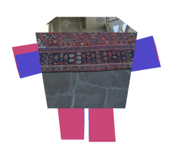
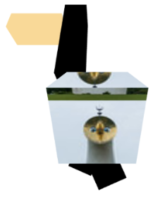
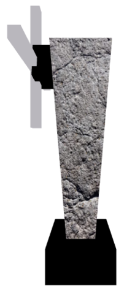
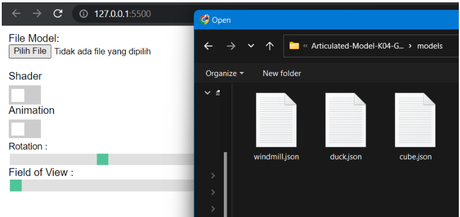
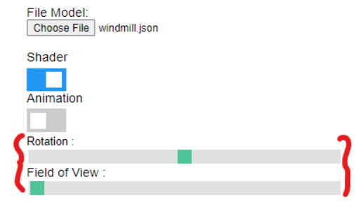
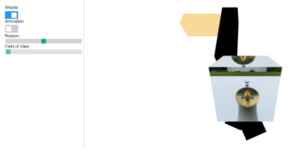
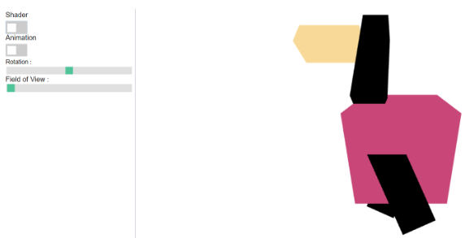

# Hollow-Object-K04-G03

Tubes 3 Grafika Komputer 2022

## Dibuat Oleh

<hr/>

1. 13519168 - Nabil Nabighah
2. 13519170 - La Ode Rajuh Emoko
3. 13519215 - Leonard Matheus

## Hasil

Kami membuat program berupa Articulated Model. Program menggunakan WebGL, HTML, CSS dan Javascript dalam pembuatannya. Link program dapat dilihat pada link berikut.

```
https://gitlab.informatika.org/leo.matt.547/Articulated-Model-K04-G13
```

Adapun struktur yang kami gunakan adalah representasi base yang membentuk tree untuk merepresentasikan child.

Berikut ini adalah hasil program yang telah kami buat.

### Model Alien (Environment Mapping)

</img>

### Model Duck (Texture Mapping)

</img>

### Model Kincir Angin (Bump Mapping)

</img>

## Manual/Contoh Fungsionalitas Program

### Load File

- Pertama-tama, untuk load model ke dalam aplikasi, tekan tombol Pilih file
- Model akan segera loading ke dalam website yang ada.
  </img>

### Reset Konfigurasi

Untuk mengembalikan model ke posisi semula, dapat menekan tombol reset.
</img>

### Setting Field of View & Rotation

Untuk mengubah behaviour dari gerakan child dari root dapat menggeser toggle yang tersedia seperti terlihat pada gambar di bawah ini. Selain itu, toggle ini juga dapat menjauhkan posisi kamera dari jarak dekat maupun jauh.
</img>

### Setting Shader/Texture & Animation

Untuk Mengubah shader warna, dapat menggunakan slider shader seperti ini kamera dari jarak dekat maupun jauh.
</img>

</img>

Selain itu, tersedia tombol animasi yang dapat digunakan untuk menampilkan animasi random pada suatu waktu
